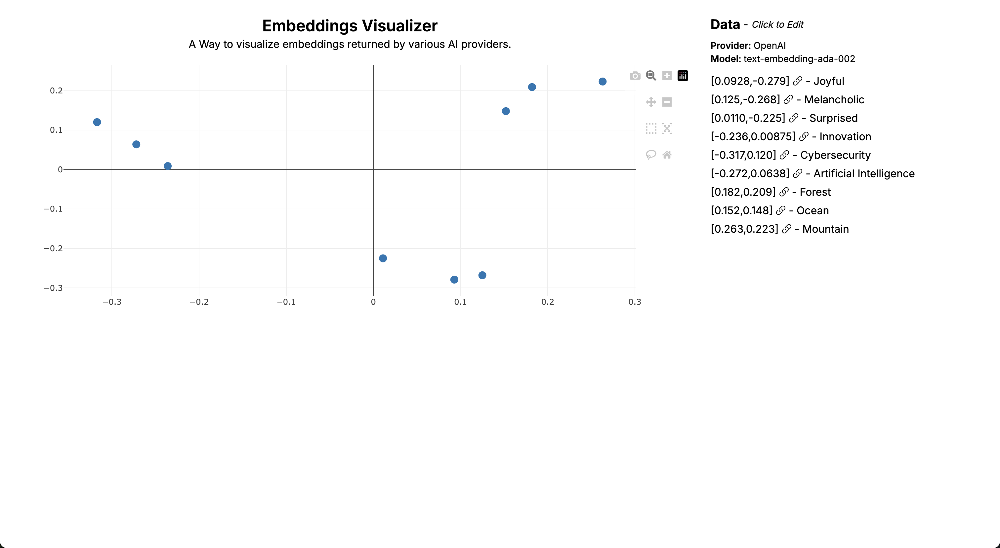

# Embeddings Visualizer

Visualize embeddings from OpenAI, Cohere or Voyage for given input a 2D space using [Principal Component Analysis](https://en.wikipedia.org/wiki/Principal_component_analysis). While this helps you visualize the inputs, I wouldn't put too much stock into proximity of results.



## Getting Started

Development server:

```bash
npm run dev
```

Open [http://localhost:3223](http://localhost:3223) with your browser to see the result.

## Docker

```
docker build -t embeddings-visualizer:latest .
docker run -d -p 3223:3223 -e OPENAI_API_KEY=$OPENAI_API_KEY -e VOYAGE_API_KEY=$VOYAGE_API_KEY -e COHERE_API_KEY=$COHERE_API_KEY --name embeddings-visualizer embeddings-visualizer:latest
```

If any of the above environment variable is not set, you'll see `"docker run" requires at least 1 argument.`. Remove that particular api key and try again.
